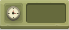

# Salto na Floresta

Um charmoso jogo de plataforma 2D desenvolvido em Python com a biblioteca Pygame Zero. Controle um herói ágil através de uma floresta desafiadora, evitando inimigos e pulando entre plataformas para alcançar o objetivo final.

---

## 📜 Sobre o Jogo

**Salto na Floresta** é uma aventura de plataforma onde a precisão e o tempo são cruciais. O objetivo é guiar o personagem do início da fase até o coração flutuante no final, superando obstáculos e inimigos que patrulham o caminho. O jogo conta com um cronômetro para desafiar os jogadores a completarem o percurso no menor tempo possível.

## ✨ Recursos
* **Jogabilidade Clássica de Plataforma:** Movimentação entre plataformas baseada em pulos para chegar até seu objetivo.

    

* **Inimigos com Patrulha:** Inimigos que se movem de um lado para o outro em suas respectivas plataformas. 

     
* **Sistema de Menus Completo:**
    * Menu Principal para iniciar o jogo.
    * Menu de Pause (ativado com a tecla `ESC`) com opções de continuar, reiniciar e voltar ao menu.
    * Telas de "GAME OVER" e "VENCEU".

* **Cronômetro:** Um contador de tempo na tela que registra sua performance. 

    

* **Música e Efeitos Sonoros:** Com opção de ligar e desligar.
* **Animações de Sprite:** Animações para o personagem e inimigos, tanto parados quanto em movimento. 

    
    
    
    

## 🛠️ Tecnologias Utilizadas

* **Python 3**
* **Pygame Zero** - Um framework para iniciantes construído sobre o Pygame.

## 🚀 Como Jogar

Siga os passos abaixo para executar o jogo em sua máquina local.

### Pré-requisitos

Você precisa ter o Python 3 e o Pygame Zero instalados.

```bash
# Instale a biblioteca Pygame Zero via pip
pip install pgzero
```

### Executando o Jogo

Abra um terminal na pasta raiz do projeto e execute o seguinte comando:

```bash
pgzrun game.py
```

### Controles

* **Setas Esquerda/Direita:** Mover o personagem.
* **Barra de Espaço** ou **Seta para Cima:** Pular
* **ESC:** Pausar / Continuar o jogo.
